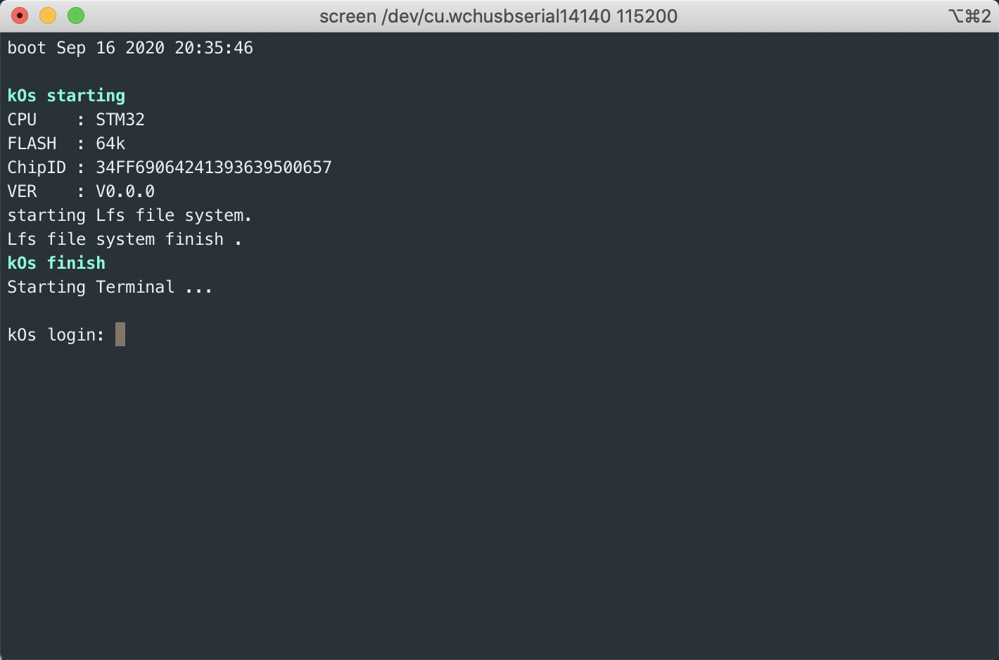
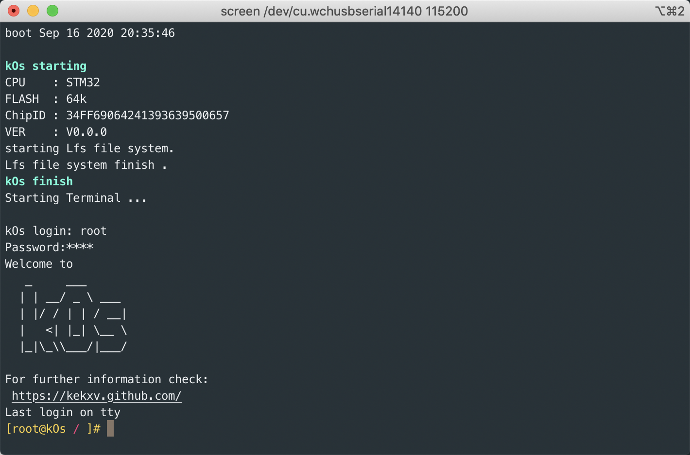
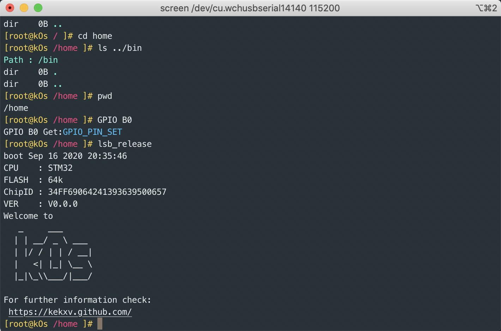
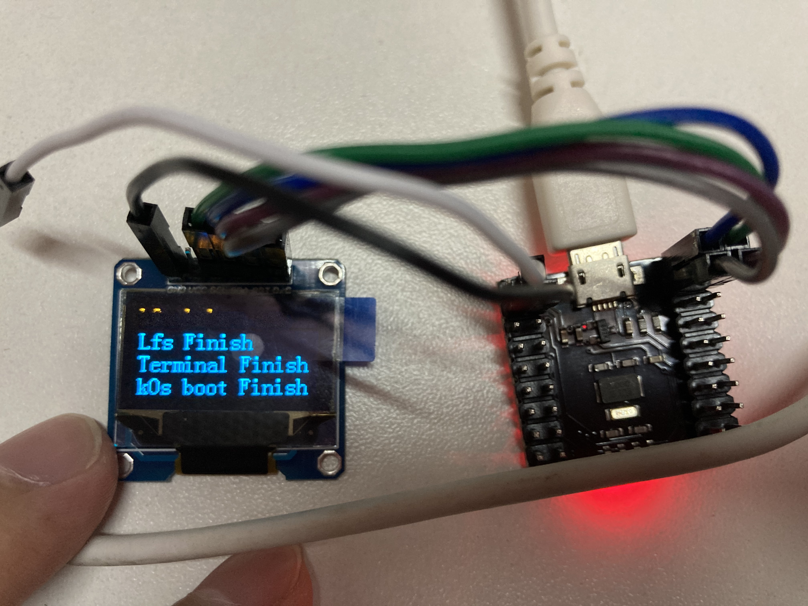
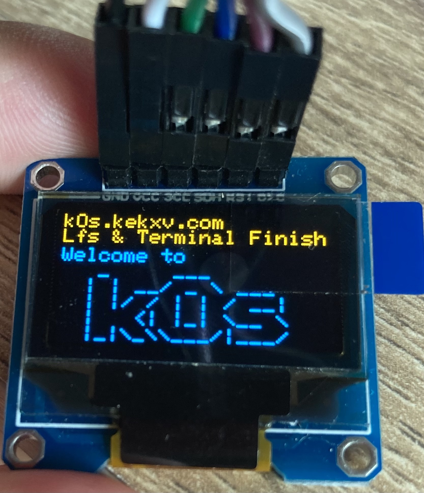

# kOs

kOs

```shell
   _     ___
  | | __/ _ \ ___
  | |/ / | | / __|
  |   <| |_| \__ \
  |_|\_\\___/|___/

```

## 支持命令

1. exit 退出
1. reboot 重启
1. pwd 输出当前路径
1. lsb_release 打印版本
1. clear 清理屏幕
1. GPIO 设置 GIPO 口 例如 `GPIO B0 0` 设置 PB0口 状态为 0;`GPIO B0` 获取 PB0 状态。
1. cd 切换目录
1. ls 列出目录内容

### OLED 软件模拟 SPI 驱动 SSD1306

支持 SSD1306 屏幕输出字符

通过 [terminal.h](Core/Util/terminal.h) 宏定义`ENABLE_SSD1306_SPI`开启关闭。默认关闭

使用 SPI 接口为

1. SCL    PIN_B12
1. SDA    PIN_B13
1. RST    PIN_B14
1. D/C    PIN_B15

模拟 SPI 发送数据。

晶振为8M，总线时钟为24M(/* PLLCLK = 8MHz / 2 * 6 = 24 MHz */),若你的环境与该代码不一样，请自行修改spi通信部分延时

### 驱动 SSD1306

硬件 SPI 驱动使用开源代码，详情可查看:[stm32-ssd1306](https://github.com/afiskon/stm32-ssd1306);

> #### stm32-ssd1306
> 
> STM32 library for working with OLEDs based on SSD1306, SH1106, SH1107 and SSD1309,
> supports I2C and 4-wire SPI.
> 
> Tested on STM32F0, STM32F1, STM32F3, STM32F4, STM32L0, STM32L4, STM32F7 and STM32H7 MCUs, with 10 random displays from eBay.
> Also this code is known to work with
> [afiskon/fpga-ssd1306-to-vga](https://github.com/afiskon/fpga-ssd1306-to-vga).
> 
> Please see `examples` directory and `ssd1306/ssd1306.h` for more details.
> 
> The code is based on
> [4ilo/ssd1306-stm32HAL](https://github.com/4ilo/ssd1306-stm32HAL) library
> developed by Olivier Van den Eede ( [@4ilo](https://github.com/4ilo) ) in 2016.
> 
> See also:
> 
> * https://github.com/afiskon/stm32-ssd1351
> * https://github.com/afiskon/stm32-st7735
> * https://github.com/afiskon/stm32-ili9341
> 
> There is a [DuyTrandeLion/nrf52-ssd1309](https://github.com/DuyTrandeLion/nrf52-ssd1309) port to nRF52 of this library made by [@DuyTrandeLion](https://github.com/DuyTrandeLion) in 2020.
> 
>
## 截图













## 参考 

部分代码参考借鉴 [MCUTerminal](https://gitee.com/o70078/MCUTerminal)