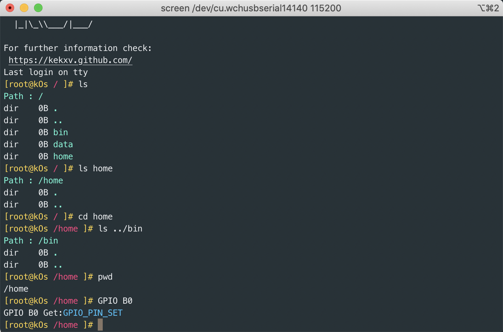

# kOs

kOs

```shell
   _     ___
  | | __/ _ \ ___
  | |/ / | | / __|
  |   <| |_| \__ \
  |_|\_\\___/|___/

```

## 支持命令

1. exit 退出
1. reboot 重启
1. pwd 输出当前路径
1. lsb_release 打印版本
1. clear 清理屏幕
1. GPIO 设置 GIPO 口 例如 `GPIO B0 0` 设置 PB0口 状态为 0;`GPIO B0` 获取 PB0 状态。
1. cd 切换目录
1. ls 列出目录内容

## 截图




