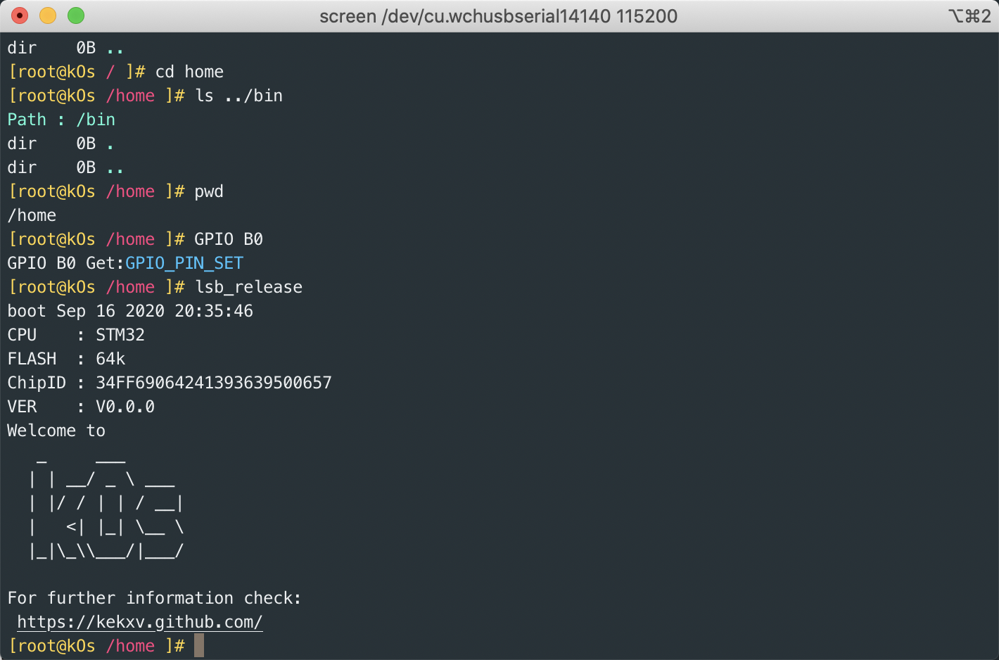
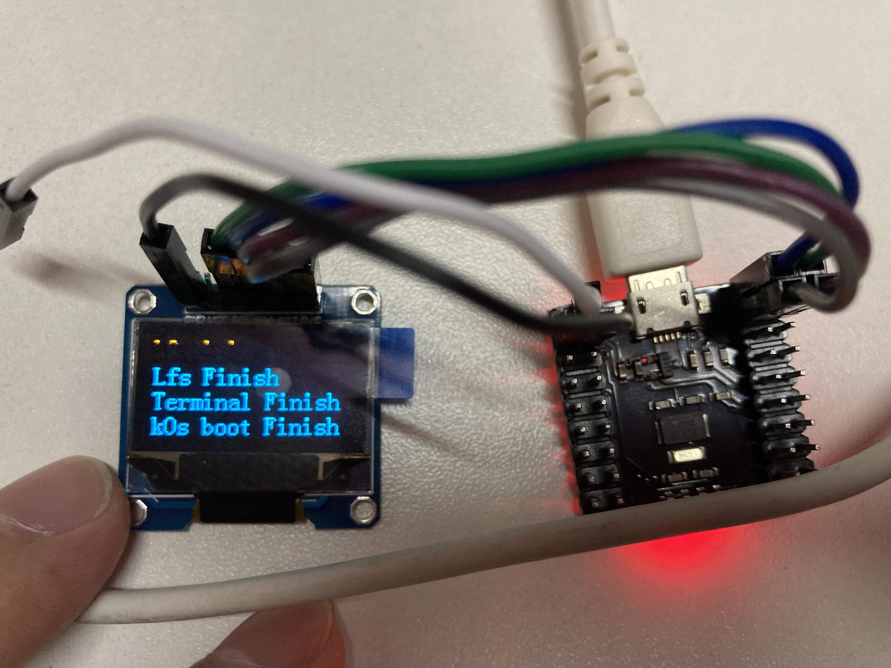
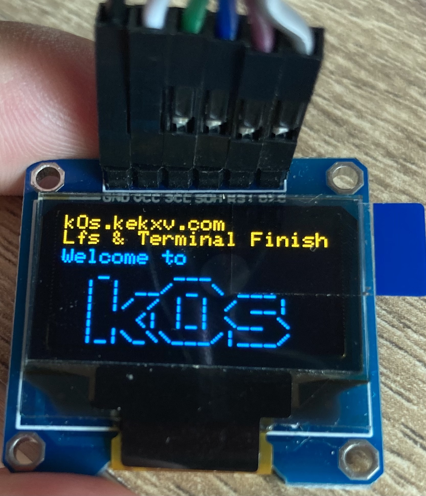

# kOs

kOs

```shell
   _     ___
  | | __/ _ \ ___
  | |/ / | | / __|
  |   <| |_| \__ \
  |_|\_\\___/|___/

```
## 支持功能stm32

-[x] Flash 读写
-[ ] TAB 显示支持命令
-[ ] 文件读写
-[ ] 时间记录
-[ ] `rz` `sz` 命令 需要安装 ： `brew install lrzsz` [在 mac 下，实现与服务器进行便捷的文件上传和下载操作。](https://github.com/aikuyun/iterm2-zmodem)

## 支持命令

1. exit 退出
1. reboot 重启
1. pwd 输出当前路径
1. lsb_release 打印版本
1. clear 清理屏幕
1. GPIO 设置 GIPO 口 例如 `GPIO B0 0` 设置 PB0口 状态为 0;`GPIO B0` 获取 PB0 状态。
1. cd 切换目录
1. ls 列出目录内容
1. mv 移动文件 或者 重命名
1. rm 删除文件或者目录
1. mkdir 创建目录
1. touch 创建文件
1. cat 打印文件

## 截图









## 参考 

部分代码参考借鉴 [MCUTerminal](https://gitee.com/o70078/MCUTerminal)